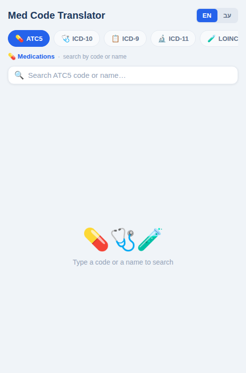
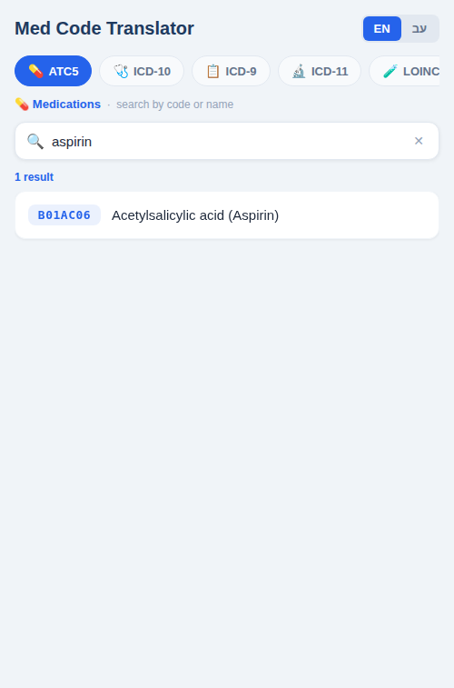
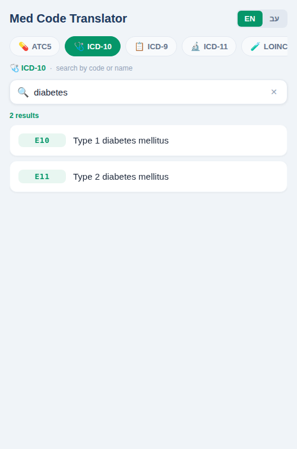
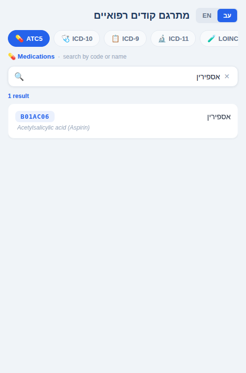
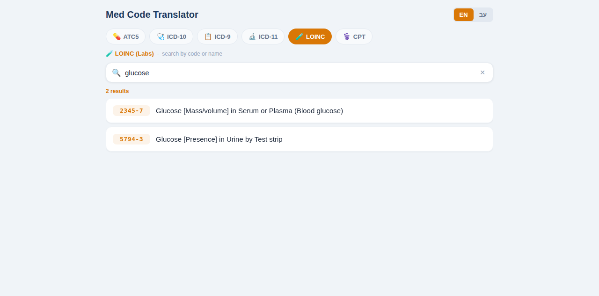

# Med Code Translator

Expo / React Native app for quickly looking up medical codes by **code** or **name** (with autocomplete and “did you mean” suggestions). Works on iOS, Android, and Web.

## Screenshots

**Mobile · Empty state**



**Mobile · ATC5 search (“aspirin”)**



**Mobile · ICD-10 search (“diabetes”)**



**Mobile · Hebrew UI**



**Web · Wide layout (LOINC “glucose”)**



## Features

- Search across multiple coding schemes (tabs)
- Instant autocomplete suggestions + inline completion (“ghost text”)
- “Did you mean…” fallback when there are no direct matches
- English + Hebrew UI/content (toggle in the header)
- Offline-friendly: seeds an on-device SQLite DB from bundled JSON datasets

## Supported Schemes

- ATC5 (Medications)
- ICD-10
- ICD-9-CM
- ICD-11
- LOINC (Labs)
- CPT-4 (Procedures)

## Quick Start

### Prerequisites

- Node.js (18+ recommended)
- npm

### Install

```bash
npm ci
```

### Run (Web)

```bash
npm run web
```

Expo prints the dev-server URL (default: `http://localhost:19006`).

### Build (Static Web)

```bash
npm run build:web
```

The static export is generated in `dist/`.

### Run (iOS / Android)

```bash
npm run ios
npm run android
```

## Deep Links (Web)

On web, you can initialize the app state from query params:

- `scheme`: `atc5 | icd10 | icd9 | icd11 | loinc | cpt`
- `q`: initial search query
- `lang`: `en | he`

Examples:

- `http://localhost:19006/?scheme=atc5&q=aspirin&lang=en`
- `http://localhost:19006/?scheme=icd10&q=diabetes&lang=en`

## How It Works (High-Level)

- On startup, `db/database.ts` seeds `expo-sqlite` tables from `assets/data/*.json` (and keeps a `schema_version` in the `meta` table).
- Searches are an exact-ish SQLite `LIKE` query (limited to 100 results) via `db/queries.ts`.
- Autocomplete + “did you mean” suggestions are powered by `fuse.js` over an in-memory index per scheme (`app/services/fuzzySearch.ts`).

## Project Structure

- `app/` — screens and UI components (Expo Router)
- `db/` — SQLite schema, seed logic, queries
- `assets/data/` — bundled datasets (JSON)
- `i18n/` — translations and i18next setup

## Notes / Disclaimer

This project is for lookup convenience and experimentation. Always validate codes and clinical decisions against authoritative sources.

## GitHub Pages Deployment

- A GitHub Actions workflow (`.github/workflows/deploy-pages.yml`) deploys the web build on every push to the default branch (`master` or `main`).
- The app is configured for project Pages path hosting (`/MedCodeTranslator`).
- Expected site URL: `https://nadavweisler.github.io/MedCodeTranslator/`

## Automated Medical DB Refresh Pipeline

- Workflow: `.github/workflows/refresh-medical-db.yml`
- Triggers:
  - Scheduled weekly refresh (`cron: 0 4 * * 1`)
  - Manual `workflow_dispatch` trigger
- Data refresh job:
  - Downloads upstream ICD-9/ICD-10/crosswalk datasets from CMS/NBER endpoints and ATC data from WHOCC endpoint.
  - Normalizes deterministic JSON outputs for app assets (`assets/data/*.json`).
  - Rebuilds a SQLite artifact at `build/medical-db/medical-codes.sqlite`.
  - Validates schema, uniqueness, hierarchy checks, crosswalk cardinality flags, and source metadata.
  - Generates a diff/update report (`build/medical-db/update-report.md`) with added/removed/changed counts.
  - Uploads `build/medical-db` as a workflow artifact.
  - Optionally opens/updates an automated PR with refreshed app JSON assets.

### Local commands

```bash
npm run refresh:data   # refresh from upstream URLs + validate + build artifacts
npm run validate:data  # offline validation/build using checked-in assets; may reuse local build/medical-db/icd9_to_icd10_gem.json if present
```

## Branch Protection

- A CI workflow (`.github/workflows/ci.yml`) runs type checking and web build validation on pull requests and pushes.
- Standard default-branch protection is defined in `.github/settings.yml`:
  - Require pull requests with at least 1 approval
  - Dismiss stale approvals on new commits
  - Require passing `CI / validate` status checks
  - Require conversation resolution and linear history
  - Disallow force pushes and branch deletion
