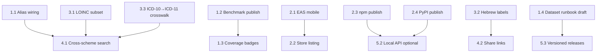

# MedCodeTranslator — Product Roadmap

This document turns the project’s strategic direction into **phased, shippable milestones**. Every item stays within [SAFE_SCOPE.md](./SAFE_SCOPE.md): terminology lookup and reference only — no diagnosis, treatment, dosing, or patient-specific guidance.

**Last updated:** 2026-07-06  
**Planning horizon:** ~6 months (Q3–Q4 2026)

---

## Goals

| Goal | Success metric |
|------|----------------|
| **Trustworthy search** | Held-out IR harness (MRR / nDCG / P@k vs FTS5); fixture smoke still gates CI |
| **Complete enough data** | Full schemes labeled; partial schemes clearly badged |
| **Reach users everywhere** | PWA + TestFlight + Play internal track |
| **Developer adoption** | `@medcode/*` on npm; `medcodetranslator` on PyPI |
| **Safe operations** | Documented refresh runbook; versioned dataset tags |

---

## Phase overview

```
Phase 1  Foundation          Jun–Jul 2026   Finish documented gaps; publish baselines
Phase 2  Distribution       Jul–Aug 2026   Mobile builds + package publishing
Phase 3  Data depth          Aug–Oct 2026   Partial datasets, Hebrew labels, crosswalks
Phase 4  Search & UX         Sep–Nov 2026   Cross-scheme search, sharing, performance
Phase 5  Platform & ops       Oct–Dec 2026   FHIR export, runbook, dataset versioning
```

Phases overlap intentionally — work can proceed in parallel when dependencies allow.

---

## Dependency graph (high level)



---

## Phase 1 — Foundation (Jun–Jul 2026)

**Status:** Implemented in repo (2026-06-27). GitHub issues: run `./scripts/create_roadmap_issues.sh` to seed the remote backlog.

Close gaps between documentation and implementation. Low regulatory risk; high credibility impact.

### 1.1 Wire alias expansion into search

| Field | Value |
|-------|-------|
| **Priority** | P2 |
| **Labels** | `type: feature`, `area: search` |
| **Depends on** | — |
| **Effort** | S (~1–2 days) |

**Problem:** `data/aliases/common.json` exists and `matchMethod: 'alias'` is in types/UI, but `packages/search/src/layered.ts` never loads aliases.

**Tasks:**
1. Load alias map at index-build time (or module init) in `app/services/fuzzySearch.ts` and/or `packages/search/`.
2. Before layered search, expand query via alias table; tag results with `matchMethod: 'alias'` when the hit came through expansion.
3. Mirror behavior in `packages/python-client/medcodetranslator/__init__.py`.
4. Add unit tests: `HTN` → hypertension codes, brand name → generic.
5. Add benchmark queries to `data/benchmarks/icd10.json` for alias cases.

**Acceptance criteria:**
- [x] Searching `HTN` on ICD-10 returns hypertension-related codes with `matchMethod: 'alias'`.
- [x] Alias layer documented in README matches runtime behavior.
- [x] `npm test` and `npm run benchmark` pass.

---

### 1.2 Publish search benchmark baselines

| Field | Value |
|-------|-------|
| **Priority** | P2 |
| **Labels** | `type: ci`, `area: search` |
| **Depends on** | — |
| **Effort** | S (~1 day) |

**Problem:** README benchmark table shows `—`; CI thresholds exist in `agents/agents-config.json` but baselines are not committed.

**Tasks:**
1. Run `npm run benchmark` locally; capture precision@1 and precision@5 per scheme.
2. Commit baseline JSON to `build/search-quality/baseline.json` (or `data/benchmarks/baseline.json`).
3. Update README benchmark table with real numbers.
4. Extend `search-quality.yml` to compare against baseline and comment on PRs (optional).

**Acceptance criteria:**
- [x] README shows non-empty benchmark results with date stamp.
- [x] CI fails if any scheme drops below configured thresholds.
- [x] Baseline file is reproducible from `npm run benchmark`.

---

### 1.5 Held-out IR evidence (not fixture theater)

| Field | Value |
|-------|-------|
| **Priority** | P2 |
| **Labels** | `type: ci`, `area: search` |
| **Depends on** | 1.2 |

**Problem:** Fixture `expected_codes` and demo chips are not a held-out IR evaluation.

**Acceptance criteria:**
- [x] Protocol-generated held-out set excludes `data/benchmarks/` and UI examples.
- [x] Harness reports MRR, nDCG@k, and true P@k.
- [x] Bake-off vs SQLite FTS5 on the same pinned vocabs, no extra licenses.
- [x] README numbers are copied from `data/eval/heldout-report.json`.

---

### 1.3 Dataset coverage badges in UI

| Field | Value |
|-------|-------|
| **Priority** | P2 |
| **Labels** | `type: feature`, `area: web`, `area: dataset` |
| **Depends on** | — |
| **Effort** | S (~1–2 days) |

**Problem:** ICD-11 (64 rows) and LOINC (600-row subset) must not be presented as full distributions next to ICD-10 (~74k).

**Tasks:**
1. Extend `source-metadata.json` schema with optional `coverage: 'full' | 'partial' | 'demo'`.
2. Mark `icd11` as `demo` and `loinc` as `partial`; mark refreshed schemes as `full`.
3. Show badge in `CodeCard` metadata / About screen / scheme tab tooltip.
4. i18n strings for badge labels in all 9 locales.

**Acceptance criteria:**
- [x] User can see at a glance which schemes are demo vs full.
- [x] No scheme is mislabeled (counts match `source-metadata.json`).

---

### 1.4 Dataset refresh runbook (draft)

| Field | Value |
|-------|-------|
| **Priority** | P2 |
| **Labels** | `type: docs`, `area: dataset` |
| **Depends on** | — |
| **Effort** | S (~1 day) |

**Problem:** CONTRIBUTING backlog calls for triage docs; upstream-sentinel and refresh workflows exist but ops knowledge is tribal.

**Tasks:**
1. Create `docs/DATASET_OPERATIONS.md` covering:
   - Weekly refresh workflow (`refresh-medical-db.yml`)
   - Upstream sentinel alerts (`upstream-sentinel.yml`)
   - Crosswalk validator failures
   - When to open `type: data` issues
2. Link from CONTRIBUTING and DATA_SOURCES.md.

**Acceptance criteria:**
- [x] New maintainer can triage a failed refresh without reading workflow YAML.
- [x] Runbook references SAFE_SCOPE and no-PHI rules.

---

## Phase 2 — Distribution (Jul–Aug 2026)

Ship beyond GitHub Pages; make packages consumable externally.

### 2.1 Mobile build pipeline (EAS)

| Field | Value |
|-------|-------|
| **Priority** | P2 |
| **Labels** | `type: ci`, `area: mobile` |
| **Depends on** | — |
| **Effort** | M (~3–5 days) |

**Tasks:**
1. Add `eas.json` with development, preview, and production profiles.
2. Configure iOS (TestFlight) and Android (internal testing) signing via EAS secrets.
3. Document build commands in `docs/DEPLOYMENT.md` (or extend architecture.md).
4. Smoke-test: app launches, SQLite seeds, search works offline.

**Acceptance criteria:**
- [x] `eas.json` with development, preview, and production profiles.
- [ ] `eas build --platform ios --profile preview` produces installable build (manual; requires `EXPO_TOKEN` / signing).
- [ ] `eas build --platform android --profile preview` produces installable build (manual).
- [x] No network calls required for search after install (offline design).

---

### 2.2 App store listing refresh

| Field | Value |
|-------|-------|
| **Priority** | P3 |
| **Labels** | `type: docs`, `area: mobile` |
| **Depends on** | 2.1 |
| **Effort** | S (~1 day) |

**Tasks:**
1. Update `store-listing.md` and `docs/APP_STORE_DESCRIPTION.md`:
   - 9 UI languages (not just EN + Hebrew)
   - 11 schemes including ATC hierarchy, HCPCS, CVX
   - Subset disclaimer for LOINC (600) and ICD-11 (64)
2. Capture required screenshots (see store-listing.md).
3. Align privacy policy URL with live GitHub Pages path.

**Acceptance criteria:**
- [ ] Store copy matches actual app capabilities.
- [ ] Screenshot set covers scheme tabs, search, Hebrew/RTL, crosswalk.

---

### 2.3 Publish TypeScript packages to npm

| Field | Value |
|-------|-------|
| **Priority** | P2 |
| **Labels** | `type: ci`, `area: search` |
| **Depends on** | 1.1, 1.2 |
| **Effort** | M (~2–3 days) |

**Tasks:**
1. Add `package.json` per package under `packages/core/` and `packages/search/`.
2. Configure npm workspaces or independent versioning.
3. CI job: `npm publish --dry-run` on PR; publish on release tag.
4. Document install in README and `docs/API.md`.

**Acceptance criteria:**
- [x] `npm install @medcode/core @medcode/search` works (workspace build; publish on GitHub Release).
- [x] Published API matches in-repo layered search behavior.

---

### 2.4 Publish Python client to PyPI

| Field | Value |
|-------|-------|
| **Priority** | P2 |
| **Labels** | `type: ci`, `area: search` |
| **Depends on** | 1.1 |
| **Effort** | M (~2–3 days) |

**Tasks:**
1. Finalize `pyproject.toml` metadata, classifiers, optional `rapidfuzz` extra.
2. Add ATC-1–4 to `SCHEME_KEYS` (parity with app).
3. CI: build wheel, `twine check`, publish on release tag.
4. Update `packages/python-client/README.md` (remove “coming soon”).

**Acceptance criteria:**
- [x] `pip install medcodetranslator` works (wheel build; publish on GitHub Release).
- [x] Search results match TS client for same query/scheme.

---

## Phase 3 — Data depth (Aug–Oct 2026)

Improve terminology coverage while respecting upstream licenses.

### 3.1 LOINC common-panel subset

| Field | Value |
|-------|-------|
| **Priority** | P2 |
| **Labels** | `type: data`, `area: dataset` |
| **Depends on** | 1.3 |
| **Effort** | L (~1–2 weeks) |

**Problem:** LOINC is 70-row demo; clinical users expect common labs (CBC, BMP, A1c, etc.).

**Tasks:**
1. Research Regenstrief redistribution terms; document in DATA_SOURCES.md.
2. Curate or import a **named subset** (e.g. top 500 observation codes by usage) with provenance.
3. Add refresh step or manual import script with validation.
4. Update `source-metadata.json`: `coverage: 'partial'`, record count, license text.
5. Expand `data/benchmarks/loinc.json`.

**Acceptance criteria:**
- [x] LOINC subset ≥ 500 codes with documented source (600-code common panel shipped).
- [x] UI shows `partial` coverage badge.
- [x] Benchmark precision@1 ≥ 0.70 for LOINC.

**Out of scope:** Full LOINC distribution without license.

---

### 3.2 Hebrew terminology labels (high-frequency ICD-10)

| Field | Value |
|-------|-------|
| **Priority** | P2 |
| **Labels** | `type: data`, `area: dataset`, `area: search` |
| **Depends on** | — |
| **Effort** | L (~1–2 weeks) |

**Problem:** UI supports `name_he` and RTL, but ICD-10 JSON has no Hebrew names.

**Tasks:**
1. Identify authoritative Hebrew ICD-10-CM source (license review required).
2. Import `name_he` for a staged rollout:
   - **Stage A:** Top 500 codes by clinical frequency
   - **Stage B:** Expand based on search analytics (if added) or contributor list
3. Ensure search matches against `name_he` in TS and Python clients.
4. Add Hebrew benchmark queries.

**Acceptance criteria:**
- [x] Hebrew UI shows Hebrew primary label when `name_he` present.
- [x] Searching Hebrew terms returns correct codes (Stage A: ~80 prefixes / ~2.5k leaf codes).
- [x] Source and license documented in source-metadata (curated; MOH review pending for full set).

---

### 3.3 ICD-10 → ICD-11 mapping (reference crosswalk)

| Field | Value |
|-------|-------|
| **Priority** | P3 |
| **Labels** | `type: data`, `area: dataset` |
| **Depends on** | 3.1 (optional) |
| **Effort** | L (~1–2 weeks) |

**Tasks:**
1. Obtain WHO ICD-10 to ICD-11 mapping (license/terms review).
2. Store crosswalk JSON; seed SQLite table (mirror ICD-9↔ICD-10 pattern).
3. Extend `crosswalk-validator` for referential integrity.
4. UI: show mapping on ICD-10/ICD-11 code selection (same UX as existing GEM crosswalk).

**Acceptance criteria:**
- [ ] Crosswalk validator passes in refresh CI.
- [ ] Selected ICD-10 code shows ICD-11 equivalents with cardinality badge.
- [ ] Mapping source attributed in UI.

---

### 3.4 Expand alias table (community-driven)

| Field | Value |
|-------|-------|
| **Priority** | P3 |
| **Labels** | `type: data`, `area: search` |
| **Depends on** | 1.1 |
| **Effort** | Ongoing |

**Tasks:**
1. Document alias contribution format in CONTRIBUTING.
2. Label GitHub issues `good first issue` for alias additions.
3. Require benchmark query per alias PR where feasible.

**Acceptance criteria:**
- [ ] Alias count grows via small, reviewable PRs.
- [ ] No invented clinical mappings — aliases must map to existing vocabulary terms.

---

## Phase 4 — Search & UX (Sep–Nov 2026)

Broader lookup patterns without crossing into clinical decision support.

### 4.1 Cross-scheme search

| Field | Value |
|-------|-------|
| **Priority** | P2 |
| **Labels** | `type: feature`, `area: search`, `area: web`, `area: mobile` |
| **Depends on** | 1.1, 3.1 (recommended) |
| **Effort** | L (~1–2 weeks) |

**Tasks:**
1. Add “All schemes” mode (or scheme group tabs: Diagnosis / Drugs / Labs / Procedures).
2. Run layered search per scheme in parallel; merge with scheme label on each result.
3. Cap total results (e.g. 30) with per-scheme fairness (round-robin or top-N per scheme).
4. Performance budget: lazy index build; show loading state on mobile.

**Acceptance criteria:**
- [x] Query `glucose` returns grouped results from LOINC, ICD, etc.
- [x] Each result shows scheme badge and existing score/matchMethod.
- [x] No new inference — results are stored entries only.

---

### 4.2 Shareable result links

| Field | Value |
|-------|-------|
| **Priority** | P3 |
| **Labels** | `type: feature`, `area: web` |
| **Depends on** | — |
| **Effort** | S (~1–2 days) |

**Problem:** URL params (`?q=&scheme=&lang=`) exist; sharing UX is not exposed.

**Tasks:**
1. “Copy link” on selected result (includes code + scheme + lang).
2. “Copy code + description” clipboard action.
3. Verify deep links work on web PWA and do not break baseUrl paths.

**Acceptance criteria:**
- [x] Shared URL opens same code/scheme/lang on web.
- [x] Clipboard actions work on web and mobile.

---

### 4.3 Search performance (ICD-10 scale)

| Field | Value |
|-------|-------|
| **Priority** | P3 |
| **Labels** | `type: feature`, `area: search` |
| **Depends on** | 4.1 |
| **Effort** | M (~3–5 days) |

**Tasks:**
1. Profile search latency on web (74k ICD-10) and mid-range Android device.
2. Evaluate SQLite FTS5 for substring layer vs in-memory scan.
3. Lazy scheme index: build on first access only (partially done — verify and document).
4. Document performance targets in architecture.md.

**Acceptance criteria:**
- [ ] P95 search latency < 200ms on reference device for ICD-10 substring query.
- [ ] No regression in benchmark precision.

---

### 4.4 Accessibility manual audit

| Field | Value |
|-------|-------|
| **Priority** | P3 |
| **Labels** | `type: docs`, `area: web`, `area: mobile`, `area: compliance` |
| **Depends on** | 2.1 |
| **Effort** | M (~2–3 days) |

**Tasks:**
1. VoiceOver (iOS) and TalkBack (Android) pass on core flows.
2. Keyboard-only web navigation for search → results → code detail.
3. RTL audit: SearchBar dropdown, CodeCard metadata, crosswalk section.
4. File issues for findings; fix P1/P2 blockers before store submission.

**Acceptance criteria:**
- [ ] Checklist completed and stored in `docs/ACCESSIBILITY.md`.
- [ ] Lighthouse a11y score remains ≥ 0.80.

---

## Phase 5 — Platform & operations (Oct–Dec 2026)

Integrations and long-term maintainability.

### 5.1 FHIR CodeSystem export

| Field | Value |
|-------|-------|
| **Priority** | P3 |
| **Labels** | `type: feature`, `area: dataset` |
| **Depends on** | 2.3 |
| **Effort** | M (~3–5 days) |

**Tasks:**
1. Script: `scripts/export_fhir_codesystem.py` — JSON per scheme.
2. Include version, publisher, and concept properties from source-metadata.
3. Document in API.md; no runtime server required initially.

**Acceptance criteria:**
- [ ] Valid FHIR R4 CodeSystem JSON for at least ICD-10 and ATC-5.
- [ ] Export is reproducible from vocabulary files.

---

### 5.2 Optional local query API (terminology-only)

| Field | Value |
|-------|-------|
| **Priority** | P3 |
| **Labels** | `type: feature`, `area: search`, `area: compliance` |
| **Depends on** | 2.3, 2.4 |
| **Effort** | M (~3–5 days) |

**Tasks:**
1. Thin HTTP server (Node or Python) wrapping existing search packages.
2. Endpoints: `GET /schemes`, `GET /search?scheme=&q=`.
3. Bind localhost only by default; no logging of query text; PHI guard patterns extended.
4. Legal/compliance note in API.md.

**Acceptance criteria:**
- [ ] Server returns same results as in-app search.
- [ ] PHI guard CI covers new server code paths.
- [ ] Default config does not expose to network.

---

### 5.3 Versioned dataset releases

| Field | Value |
|-------|-------|
| **Priority** | P3 |
| **Labels** | `type: ci`, `area: dataset` |
| **Depends on** | 1.4 |
| **Effort** | S (~1–2 days) |

**Tasks:**
1. Git tag format: `dataset-YYYY.MM` on successful weekly refresh merge.
2. Release notes: record counts, source revisions from source-metadata.
3. App displays bundled dataset tag in About screen.

**Acceptance criteria:**
- [ ] Dataset tag `dataset-YYYY.MM` is published with an immutable vocabulary snapshot.
- [ ] App About shows current dataset version.

---

### 5.4 Evaluate new schemes (RxNorm, NDC)

| Field | Value |
|-------|-------|
| **Priority** | P3 |
| **Labels** | `type: data`, `area: dataset`, `area: compliance` |
| **Depends on** | 1.4 |
| **Effort** | Research spike (~2 days) |

**Tasks:**
1. License review for RxNorm (NLM) and NDC (FDA).
2. Spike: record counts, refresh feasibility, SAFE_SCOPE fit.
3. Decision doc in DATA_SOURCES.md — proceed or defer.

**Acceptance criteria:**
- [ ] Written go/no-go with license summary.
- [ ] If go: follow “Adding a New Terminology Scheme” in architecture.md.

**Explicitly deferred without license path:** SNOMED CT, full LOINC.

---

## Milestones & release mapping

| Milestone | Target | Includes | App version bump |
|-----------|--------|----------|------------------|
| **v1.1 — Foundation** | Jul 2026 | 1.1–1.4 | 1.1.0 |
| **v1.2 — Mobile beta** | Aug 2026 | 2.1–2.2 | 1.2.0 |
| **v1.3 — Packages** | Aug 2026 | 2.3–2.4 | — (package tags) |
| **v1.4 — Data depth** | Oct 2026 | 3.1–3.3 | 1.4.0 |
| **v2.0 — Unified search** | Nov 2026 | 4.1–4.3 | 2.0.0 |
| **v2.1 — Platform** | Dec 2026 | 5.1–5.3 | 2.1.0 |

---

## GitHub issue seed list

Use these titles when opening the backlog (labels from `.github/settings.yml`):

| ID | Title | Labels |
|----|-------|--------|
| 1.1 | Wire alias expansion into layered search | `type: feature`, `area: search`, `priority: P2` |
| 1.2 | Commit search benchmark baselines and update README | `type: ci`, `area: search`, `priority: P2` |
| 1.3 | Show dataset coverage badges (full vs demo) in UI | `type: feature`, `area: dataset`, `priority: P2` |
| 1.4 | Write dataset refresh and triage runbook | `type: docs`, `area: dataset`, `priority: P2` |
| 2.1 | Add EAS config and first iOS/Android preview builds | `type: ci`, `area: mobile`, `priority: P2` |
| 2.2 | Refresh App Store and Play Store listing copy | `type: docs`, `area: mobile`, `priority: P3` |
| 2.3 | Publish @medcode/core and @medcode/search to npm | `type: ci`, `area: search`, `priority: P2` |
| 2.4 | Publish medcodetranslator to PyPI | `type: ci`, `area: search`, `priority: P2` |
| 3.1 | Import LOINC common-panel subset with license docs | `type: data`, `area: dataset`, `priority: P2` |
| 3.2 | Add Hebrew name_he labels for high-frequency ICD-10 | `type: data`, `area: dataset`, `priority: P2` |
| 3.3 | Add ICD-10 to ICD-11 reference crosswalk | `type: data`, `area: dataset`, `priority: P3` |
| 4.1 | Implement cross-scheme search mode | `type: feature`, `area: search`, `priority: P2` |
| 4.2 | Add copy-link and copy-code sharing actions | `type: feature`, `area: web`, `priority: P3` |
| 4.3 | Optimize ICD-10 search performance | `type: feature`, `area: search`, `priority: P3` |
| 4.4 | Complete manual accessibility audit checklist | `type: docs`, `area: compliance`, `priority: P3` |
| 5.1 | Export vocabularies as FHIR CodeSystem JSON | `type: feature`, `area: dataset`, `priority: P3` |
| 5.2 | Add optional localhost terminology query API | `type: feature`, `area: search`, `priority: P3` |
| 5.3 | Tag versioned dataset releases | `type: ci`, `area: dataset`, `priority: P3` |
| 5.4 | Spike: RxNorm and NDC licensing and feasibility | `type: data`, `area: compliance`, `priority: P3` |

---

## Scope guardrails (do not plan without legal review)

- Diagnosis suggestion or “what code fits this description” beyond retrieval
- Drug interaction, contraindication, or dosing features
- LLM-generated clinical content
- Patient-specific inputs or risk scoring
- SNOMED CT without explicit license

See [SAFE_SCOPE.md](./SAFE_SCOPE.md) and [CONTRIBUTING.md](../CONTRIBUTING.md).

---

## How to use this roadmap

1. **Triage:** Open issues from the seed list; add `needs-triage`, then priority/area labels.
2. **Sprint:** Pick one milestone; prefer finishing Phase 1 before parallel Phase 3/4 work.
3. **PRs:** One issue per PR where possible; link issue in PR description.
4. **Review:** Any data or crosswalk PR must pass `validate:data`, `benchmark`, and crosswalk-validator.
5. **Update:** Revise this doc when milestones ship or priorities change.

---

## Related docs

- [Architecture](./architecture.md)
- [API & integration notes](./API.md)
- [Safe scope](./SAFE_SCOPE.md)
- [Data sources](../DATA_SOURCES.md)
- [Contributing](../CONTRIBUTING.md)
- [Agents](../agents/README.md)
